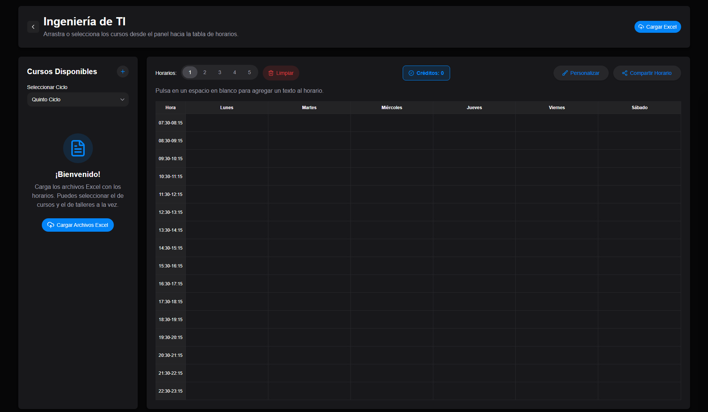

# ESAN Horarios

Aplicación web interactiva para la gestión y creación de horarios académicos de la Universidad ESAN, desarrollada con Next.js y HeroUI.
[Ver la página](https://esanhorarios.vercel.app)

## Cómo Usar

1. **Importa el archivo Excel** con horarios disponibles
2. **Selecciona tu ciclo académico** desde el menú desplegable
3. **Arrastra o selecciona tus cursos** desde la lista hacia los slots de horario
4. **Personaliza tu horario** pulsando el boton de personalizar
5. **Comparte tu horario** exportándolo como imagen

## Características

### Gestión de Cursos
- **10 ciclos académicos** completamente configurados
- **Sistema de créditos** automático para cada curso
- **Sistema anticonflicto** para evitar cursos que se superpongan

### Personalización Visual
- **7 paletas de colores** temáticas diferentes
- **Interfaz drag & drop** intuitiva para organizar horarios
- **Cálculo de créditos totales** en tiempo real

### Procesamiento de Archivos
- **Importación de archivos Excel** con horarios disponibles
- **Mapeo automático** de nombres de cursos
- **Validación de formatos** y manejo de errores

### Funciones de Compartir
- **Exportación a imagen** del horario creado
- **Función de copiado** integrada
- **Exportación a Excel** del horario creado

## Inicio Rápido

### Prerrequisitos
- Node.js 18.17 o superior
- npm, yarn, pnpm o bun

### Instalación

1. Clona el repositorio:
```bash
git clone https://github.com/PaoloESAN/esanhorarios.git
cd esanhorarios
```

2. Instala las dependencias:
```bash
npm install
# o
yarn install
# o
pnpm install
```

3. Ejecuta el servidor de desarrollo:
```bash
npm run dev
# o
yarn dev
# o
pnpm dev
# o
bun dev
```

4. Abre [http://localhost:3000](http://localhost:3000) en tu navegador.

## Tecnologías Utilizadas

- **[Next.js 16](https://nextjs.org/)** - Framework de React con App Router
- **[React 19.2](https://react.dev/)** - Biblioteca de interfaz de usuario
- **[HeroUI v3](https://heroui.com/)** - Biblioteca de componentes UI moderna
- **[Tailwind CSS 4](https://tailwindcss.com/)** - Framework de CSS utility-first
- **[Framer Motion](https://www.framer.com/motion/)** - Biblioteca de animaciones
- **[Lucide React](https://lucide.dev/)** - Biblioteca de íconos SVG
- **[XLSX](https://sheetjs.com/)** - Procesamiento de archivos Excel
- **[html2canvas-pro](https://github.com/yorickshan/html2canvas-pro)** - Exportación de DOM a imagen
- **[Vitest](https://vitest.dev/)** - Framework de pruebas

## Tests

Para corroborar que los cursos y los horarios se configuren correctamente, hay tests automatizados disponibles:

1. Abre la carpeta `tests/excel/` en la raíz del proyecto
2. Coloca tu archivo Excel (`.xlsx` o `.xls`) con los horarios a probar dentro de esa carpeta de test
3. Ejecuta los tests usando Vitest:

```bash
npm run test
```
o si usas yarn/pnpm/bun:
```bash
yarn test
```

También puedes ejecutar un test individual para un curso específico:

```bash
npm run test:curso
```
o si usas yarn/pnpm/bun:
```bash
yarn test:curso
```

## Comandos Disponibles

```bash
npm run dev      # Inicia el servidor de desarrollo con Turbopack
npm run build    # Construye la aplicación para producción
npm run start    # Inicia el servidor de producción
npm run lint     # Ejecuta el linter de ESLint
npm run test     # Ejecuta los tests
npm run test:curso # Ejecuta un test individual para un curso
```

## Contribuciones

Las contribuciones son bienvenidas. Por favor:

1. Haz fork del proyecto
2. Crea una rama para tu feature (`git checkout -b feature/AmazingFeature`)
3. Commit tus cambios (`git commit -m 'Add some AmazingFeature'`)
4. Push a la rama (`git push origin feature/AmazingFeature`)
5. Abre un Pull Request

## Autor

**Paolo** - [PaoloESAN](https://github.com/PaoloESAN)

